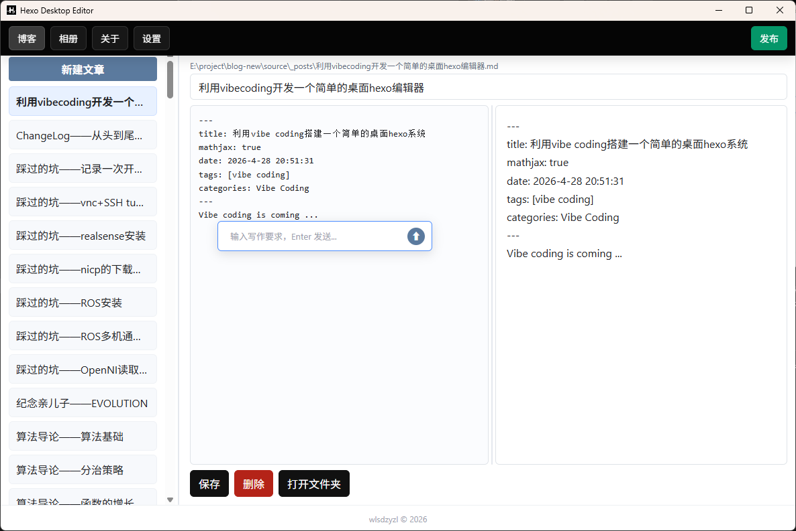

# Hexo Desktop Editor



基于 Electron 的本地 Hexo 博客桌面编辑工具。提供 Markdown 编辑器（实时预览 + AI 写作）、相册管理器、关于页面编辑和发布功能，无需自己去打开blog目录、新建或者选择文件以及使用命令行来进行编辑发布等操作。所有功能直接作用于本地 Hexo 项目文件系统。

[](LICENSE)

## 功能

- **博客编辑** — Markdown 编辑器（语法高亮 + 实时预览），支持 MathJax 数学公式
- **AI 写作** — 集成 DeepSeek，`Ctrl+I` 唤起，自动生成内容插入光标位置
- **相册管理** — 上传、重命名、删除图片，支持中文文件名
- **关于页面** — 独立的 Markdown 编辑 + 预览，编辑 `source/about/index.md`
- **一键发布** — 执行 `hexo generate` + Git 提交推送，实时显示日志
- **可配置** — 图形化设置界面，修改即时生效

## 环境要求

本项目面对那些之前已经部署并且使用过hexo blog的同学，需要本地已安装 [Hexo](https://hexo.io/) 博客。仅需配置博客路径，编辑器即直接操作 `source/_posts` 等目录下的 Markdown 文件。

## 安装

Windows 可直接下载安装程序（NSIS 安装包）。

从源码构建：

```bash
git clone https://github.com/wlsdzyzl/hexo-desktop.git
cd hexo-desktop
npm install
npm start
```

## 构建

```bash
npm run build          # 构建当前平台
npm run build:win      # 构建 Windows NSIS 安装包
```

## 配置

编辑 `config.json`（打包版本位于 `%APPDATA%/hexo-desktop/config.json`）：

```json
{
  "hexoPath": "E:/project/my-blog",
  "photoDir": "photos",
  "aboutDir": "about",
  "sourceBrance": "main",
  "publicBrance": "gh-pages",
  "commitMessage": "Update blog",
  "deepseekAPIKey": "sk-xxxxxxxxxxxxx"
}
```

| 字段 | 说明 | 必填 |
|------|------|------|
| `hexoPath` | Hexo 博客项目本地路径 | ✅ |
| `photoDir` | 相册目录（相对于 `source/`），不填则没有相册功能 | ❌ |
| `aboutDir` | 关于目录（相对于 `source/`），不填则没有编辑主页功能 | ❌ |
| `sourceBrance` | 源码分支名 | ❌ |
| `publicBrance` | 静态页面分支名 | ❌ |
| `commitMessage` | 发布提交信息 | ❌ |
| `deepseekAPIKey` | DeepSeek API 密钥，不填则无法使用 AI writing 功能 | ❌ |

## 使用指南

### 博客编辑

- 左侧文章列表 → 点击切换文章
- 中间 Markdown 编辑器 → 右侧实时预览
- 拖拽中间分隔条可调整编辑/预览宽度
- `Ctrl+S` 保存，标题变更自动重命名文件
- 支持新建和删除文章

### AI 写作

- 编辑器右下角可见"按 Ctrl+I 进入 AI 写作"
- `Ctrl+I` → 在光标附近弹出输入框
- 输入写作要求 → `Enter` 或点击 ⬆ 发送
- 生成内容自动插入光标位置

### 相册

- 顶栏点击"相册" → 上传 / 刷新图片
- 支持子目录遍历、图片预览
- 点击文件名 → 重命名
- 点击 ❌ → 二次确认后删除

### 关于页面

- 顶栏点击"关于" → Markdown 编辑器打开 `source/about/index.md`
- 编辑 + 实时预览 → 点击"保存"

### 发布

- 顶栏点击绿色"发布"按钮
- 自动执行 `hexo generate` → Git 提交源码 → 自动检测 Git Remote → 推送静态页面到 `gh-pages` 分支
- 终端风格窗口实时显示日志

### 设置

- 点击"设置"按钮 → 图形化编辑所有配置项
- 点击"保存"后即时生效并刷新页面

## 项目结构

```
hexo-desktop/
├── css/
│   └── shared.css            # 共享样式
├── js/
│   ├── preload.js            # 上下文桥接（contextBridge）
│   ├── shared.js             # 共享逻辑（导航、发布、Markdown 渲染）
│   ├── blog.js               # 博客编辑页
│   ├── photos.js             # 相册页
│   ├── about.js              # 关于页
│   └── publish.js            # 发布脚本（hexo g + git push）
├── index.html                # 博客编辑页
├── photos.html               # 相册页
├── about.html                # 关于页
├── main.js                   # Electron 主进程
├── config.json               # 用户配置
├── icon.ico                  # 应用图标
└── package.json
```

## 技术栈

- **Electron 41** — 多进程桌面架构，`contextIsolation: true` 安全隔离
- **原生 JS** — 无前端框架，透明 textarea + pre 叠层语法高亮
- **手写 Markdown 渲染器** — 轻量、无外部依赖，位于 `js/shared.js`
- **MathJax 3** — CDN 加载，支持 LaTeX 数学公式渲染
- **DeepSeek Chat API** — AI 写作辅助，通过主进程代理请求
- **electron-builder** — 跨平台打包（NSIS / DMG / AppImage）
- **simple-git** — 发布流程中的 Git 操作

## 许可

本项目基于 [MIT License](https://opensource.org/licenses/MIT) 开源。

MIT 许可证授予任何人在不受限制的情况下使用、复制、修改、合并、发布、分发、再许可和/或销售本软件的副本，前提是在所有副本或实质性部分中包含版权声明和本许可声明。软件按"原样"提供，不提供任何形式的明示或暗示担保。

> Copyright (c) 2026 wlsdzyzl
